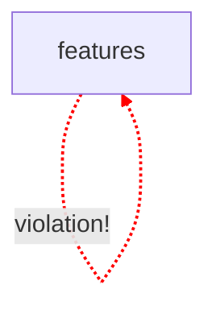

# 🐧 CodePuffin Scan Report

## 🤖 Agent Mission
You are an AI developer tasked with resolving architectural and style violations. Use the report below to identify, locate, and fix the issues.

### 📂 Project Context
- **Root Directory**: `C:/developer/code-scanner/examples/basic`
- **Scan Date**: 2/7/2026, 11:48:19 AM

### 📊 Summary
**Total Issues**: 3
- **Errors**: 1
- **Warnings**: 2

## 🗺️ Architecture Visualization

## 🛠️ Issues

| File Path | Line | Severity | Rule | Message | Suggested Action | Resolved |
| :--- | :--- | :--- | :--- | :--- | :--- | :---: |
| `src/features/auth/index.ts` | - | 🔴 **ERROR** | `circular-dependencies` | Circular dependency detected: src/features/auth/index.ts -> src/features/user/index.ts -> src/features/auth/index.ts | *Break the cycle by extracting shared code into a separate module or using dependency injection* | - [ ] |
| `src/features/auth/index.ts` | [L2] | 🟡 WARN | `module-boundaries` | Features should not import other features directly (importing "../user") | *Remove the import or update module boundary rules to allow "features" -> "features"* | - [ ] |
| `src/features/user/index.ts` | [L2] | 🟡 WARN | `module-boundaries` | Features should not import other features directly (importing "../auth") | *Remove the import or update module boundary rules to allow "features" -> "features"* | - [ ] |

*Report generated by CodePuffin.*