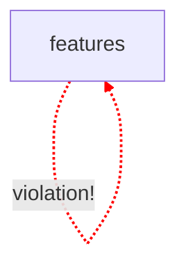

# 🐧 CodePuffin Scan Report

## 🤖 Agent Mission
You are an AI developer tasked with resolving architectural and style violations. Use the report below to identify, locate, and fix the issues.

### 📂 Project Context
- **Root Directory**: `C:/developer/code-scanner/tests/integration/fixtures/next-advanced-project`
- **Scan Date**: 2/7/2026, 11:48:21 AM

### 📊 Summary
**Total Issues**: 1
- **Errors**: 1
- **Warnings**: 0

## 🗺️ Architecture Visualization

## 🛠️ Issues

| File Path | Line | Severity | Rule | Message | Suggested Action | Resolved |
| :--- | :--- | :--- | :--- | :--- | :--- | :---: |
| `src/features/auth/index.ts` | [L2] | 🔴 **ERROR** | `module-boundaries` | Module "features" cannot import from "features" (importing "../user") | *Remove the import or update module boundary rules to allow "features" -> "features"* | - [ ] |

*Report generated by CodePuffin.*